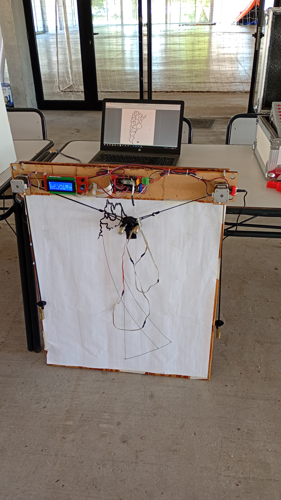
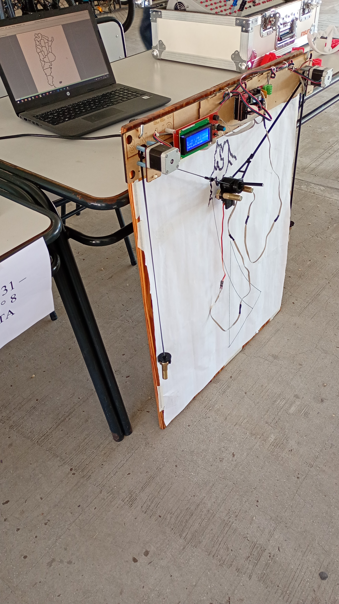
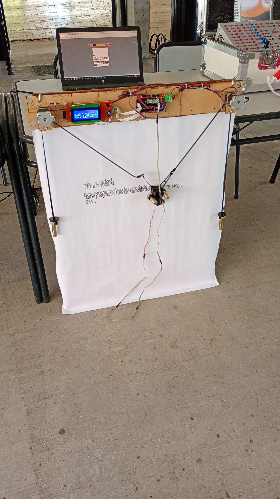
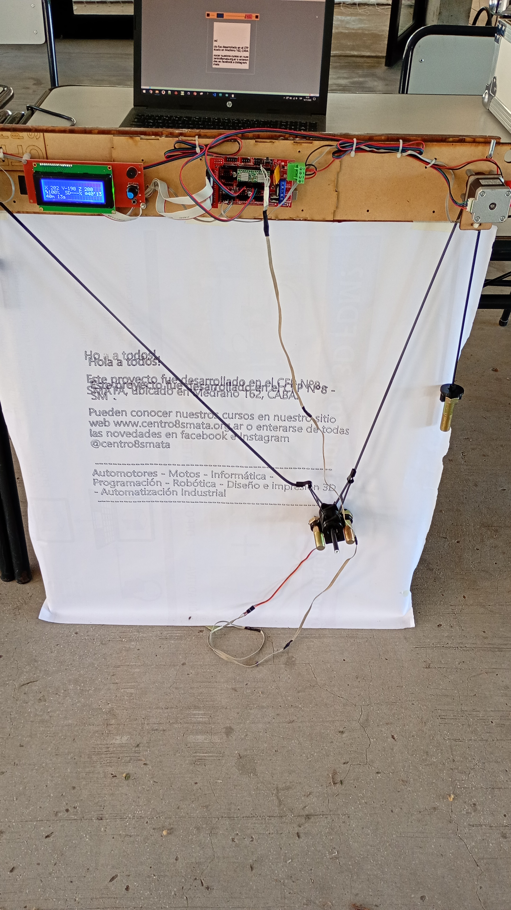

# Polagraph
Proyecto desarrollado en el FABLAB del Centro de Formación Profesional Nº8 - SMATA

## Materiales
- Tabla de madera (1)
- Arduino MEGA 2560 (1)
- RAMPS 1.4 (1)
- Motor NEMA 17 (2)
- Switch final de carrera (2)
- Bulón 3 1/2 (4)
- Correa GT2 6mm (3m)
- Polea dentada 60 dientes para correa GT2 eje 5mm (2)
- Piezas impresas en 3D para el cabezal
- Módulo REPRAP Smart Controller

## Firmware
https://github.com/MarginallyClever/Marlin/tree/2.1.x-polargraph

## Software
https://github.com/MarginallyClever/Makelangelo-software

## Update firmware from makelangelo software
https://mcr.dozuki.com/Guide/5.+How+To+Update+Makelangelo+Firmware/42?lang=en

## How to use Makelangelo Software
https://mcr.dozuki.com/Guide/4.+How+to+use+Makelangelo+Software+7.32+/39

## Links útiles
http://www.polargraph.co.uk/2016/06/autorun/
https://www.thingiverse.com/thing:2494228/files
https://www.mydiy.dev/realisations_drawbot.html
https://mcr.dozuki.com/Guide/3.+Pen+Holder+Assembly+2023/40?lang=en
https://www.marginallyclever.com/2021/10/friday-facts-4-how-to-marlin-polargraph/

## Proyectos similares
https://www.tinkercad.com/projects/Polargraph-Plotter
https://www.instructables.com/BLACKBOARD-V-PLOTTER/ (lo hace con arduino + ramps)
https://www.marginallyclever.com/products/makelangelo-5/
https://lizmelchor.com/wall-robot/?v=fa868488740a